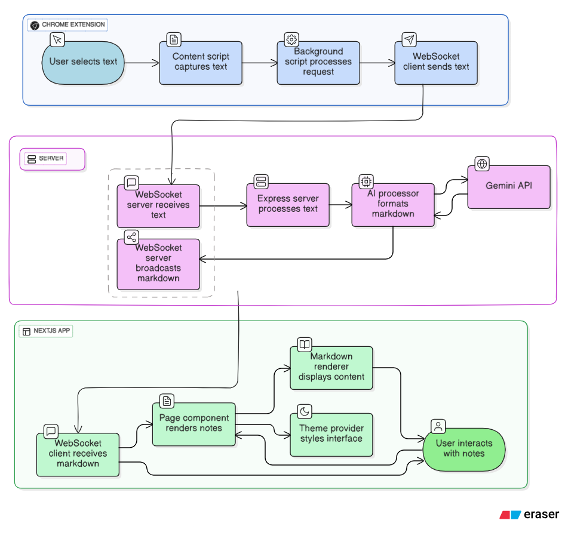

# Smart Markdown Studio


Smart Markdown Studio is a privacy-first, AI powered fully local note-taking system that that lets you capture any note from web in a single click and instantly turn it into clean, structured Markdown Note.

The system consists of:
- **Chrome Extension** — Capture text from any website using a shortcut.
- **Local Express/Gemini Server** — Processes text with the Gemini API according to customizable formatting rules.
- **Dashboard** — View, search, copy, and export notes in real time.

- [see architecture](#system-architecture)
---

## Features

- **Privacy First**: All notes are processed and stored locally; data never leaves the machine except for API calls to Gemini.
- **Bring Your Own Key**: Use your personal Gemini API key, ensuring no vendor lock-in.
- **Rich Markdown Rendering**: Includes syntax-highlighted code blocks, tables, and other formatting.
- **Real-Time Dashboard**: Live WebSocket updates when notes are processed.
- **Multi-Format Export**: Copy individual notes, copy all notes, or download as `.md` files.
- **Theme Support**: Light and dark themes inspired by Obsidian and Notion.

---

## Demo Video

<iframe width="560" height="315" src="https://www.youtube.com/embed/0dIz31IWYZU?si=2lSUTE-fSVM_b2pX" title="YouTube video player" frameborder="0" allow="accelerometer; autoplay; clipboard-write; encrypted-media; gyroscope; picture-in-picture; web-share" referrerpolicy="strict-origin-when-cross-origin" allowfullscreen></iframe>

## Installation & Setup

### 1. Clone the repository
```bash
git clone https://github.com/DebakantPradhan/ai-markdown-local.git
cd ai-markdown-local
````

### 2. Install dependencies

```bash
npm install
```

### 3. Configure environment variables

Create a `.env` file in the project root and add:

```
GEMINI_API_KEY=your_key_here
WS_PORT=3001
```

### 4. Development mode

Run the Next.js frontend and Gemini server concurrently:

```bash
npm run dev
```

### 5. Build for production

Build the frontend and package the extension:

```bash
npm run build
```

### 6. Start production servers

```bash
npm start
```

### 7. Load Chrome Extension

1. Open `chrome://extensions/`
2. Enable *Developer Mode*
3. Select **Load unpacked** and choose the `chrome-extension/` folder, or use the packaged zip located at `dist/chrome-extension.zip`.

---

## Distribution Output

After running `npm run build`, the `dist/` directory will contain:

```
dist/
├── chrome-extension.zip   # Ready-to-load Chrome extension
├── frontend/              # Built Next.js app
└── server/                # Express server bundle
```

---

## How It Works

1. **Chrome Extension** — User selects text and sends it to the local Gemini server.
2. **Gemini Server** — Formats content into structured Markdown according to the system prompt.
3. **Dashboard (Next.js)** — Receives WebSocket updates and instantly displays the note.
4. **User Actions** — Copy, export, search, tag, or manage notes.

## System Architecture



---

## Why Local?

This system was designed with:

* **Privacy** — No centralized storage; all processing and storage is local.
* **Control** — You own the keys, data, and storage.
* **Transparency** — Open codebase with customizable prompts.

---

## License

MIT License — Free to use, modify, and distribute.


